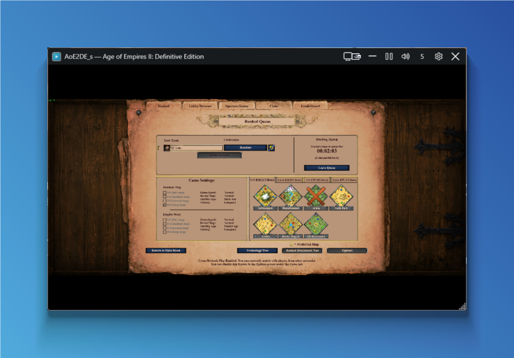

<h1 align="center">MiniPreview</h1>

<p align="center">
  A tiny floating live thumbnail of any window on your screen — keep an eye on a game, a stream, or a render while you do something else.
</p>

<p align="center">
  <a href="https://github.com/iamLukyy/MiniPreview/releases/latest"></a>
  
  
  <a href="LICENSE"></a>
</p>

<p align="center">
  
</p>

---

## What it does

Pick any window on your PC and MiniPreview will display a small always-on-top live preview of it. Pause it when you don't need it, drop the framerate to 1 FPS when you only care that *something is happening*, or crank it to 30 FPS when you want it smooth.

Because it uses **Windows Graphics Capture** — the same path Game Bar and OBS take — the impact on the source app's FPS is negligible. Borderless games, fullscreen videos, hidden corners of the desktop: it all works.

## Features

- **Floating top-most preview** — drag it anywhere, resize from the corner. Position and size are remembered.
- **Adjustable FPS** — 1, 2, 5, 10, 15 or 30. Default 5.
- **Pause / resume** — fully tears down the capture session, so paused = zero overhead.
- **Per-process mute** — silence the target app without touching system volume. State syncs with the Windows volume mixer.
- **Force minimize / restore** the target app from the toolbar.
- **Global hotkeys** — defaults `Ctrl+Alt+P` (pause), `Ctrl+Alt+M` (mute), `Ctrl+Alt+L` (picker), `Ctrl+Alt+H` (minimize target). Customizable in Settings.
- **Click-to-pick** or pick from a list of every open window (with their icons).
- **Languages** — English (default) and Czech, switchable in Settings.
- **Single-file portable executable** — no installer, no admin rights, drop the `.exe` anywhere and run.

## Quick start

1. Grab `MiniPreview-win-x64.exe` from the [latest release](https://github.com/iamLukyy/MiniPreview/releases/latest).
2. Double-click it. (Windows SmartScreen may warn on first run — *More info → Run anyway*.)
3. Click the monitor icon in the toolbar and pick any window you want to watch.

The .exe is self-contained — it carries the .NET runtime with it, so it works on any Windows 10/11 x64 machine without installing anything.

## Downloads

| File | Architecture | Type | Size | Notes |
|---|---|---|---|---|
| `MiniPreview-win-x64.exe` | x64 | Self-contained | ~78 MB | Recommended for most PCs |
| `MiniPreview-win-x86.exe` | x86 (32-bit) | Self-contained | ~74 MB | For 32-bit Windows |
| `MiniPreview-win-arm64.exe` | ARM64 | Self-contained | ~76 MB | Surface Pro X, Snapdragon laptops |
| `MiniPreview-portable-x64.zip` | x64 | Framework-dependent | ~2 MB | Requires [.NET 8 Desktop Runtime](https://dotnet.microsoft.com/download/dotnet/8.0) installed |

## Settings

All settings live in `%APPDATA%\MiniPreview\settings.json`. From the Settings dialog you can configure:

- **Language** — English / Čeština (requires restart)
- **Hotkeys** — format like `Ctrl+Alt+P`. Modifiers: `Ctrl`, `Alt`, `Shift`, `Win`. Key: `A-Z`, `0-9`, `F1-F24`.
- **Start with Windows** — adds an autostart entry under `HKCU\…\Run`.
- **Always on top** — keeps the preview above all other windows (on by default).

## Building from source

Requires the [.NET 8 SDK](https://dotnet.microsoft.com/download/dotnet/8.0).

```powershell
git clone https://github.com/iamLukyy/MiniPreview.git
cd MiniPreview
dotnet build -c Release
dotnet run --project src/MiniPreview/MiniPreview.csproj
```

For a single-file release executable:

```powershell
dotnet publish src/MiniPreview/MiniPreview.csproj `
  -c Release -r win-x64 --self-contained true `
  -p:PublishSingleFile=true `
  -p:IncludeNativeLibrariesForSelfExtract=true `
  -p:EnableCompressionInSingleFile=true `
  -o ./dist
```

Replace `win-x64` with `win-x86` or `win-arm64` for the other architectures.

## How it works

```
Target window  →  Windows.Graphics.Capture (free-threaded frame pool)
              →   D3D11 staging texture copy
              →   pacing gate (drops frames over the FPS budget)
              →   raw BGRA bytes
              →   WriteableBitmap on the UI thread
```

Audio mute uses the WASAPI session API via NAudio, matching sessions by the target process ID.

## Limitations

- Some fullscreen-exclusive games will deliver black frames — Windows Graphics Capture works best with **borderless windowed** mode. Switch the game's display mode and the preview should light up.
- Minimized targets produce no frames (this is a WGC restriction, not a bug). The toolbar's restore button brings the target back.
- Windows 10 1903 or later is required (for the WGC API).

## License

MIT — see [LICENSE](LICENSE).
